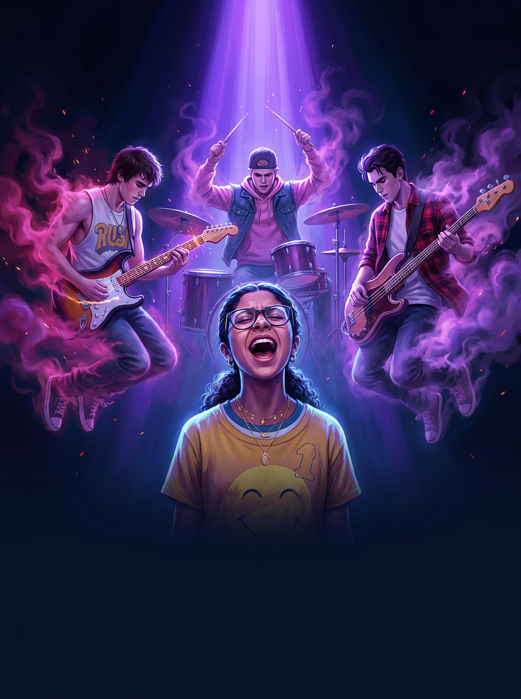

# I built an unofficial *Julie and the Phantoms* finale — script, trailer, and storybook — almost entirely with AI

*Julie and the Phantoms* got one perfect season on Netflix and then got cancelled — on a
**cliffhanger.** Caleb possesses Nick, the boys are still cursed, Julie can suddenly touch
her ghosts, and… that's it. Forever.

I couldn't let it go. So I made the finale myself: a full **screenplay**, a ~2-minute
**photorealistic trailer**, and an illustrated **storybook** — using the show's own footage
as a starting point and a stack of AI models to do the heavy lifting. This is the build log.

> ⚠️ **Fan work, personal/non-commercial, fair use.** *Julie and the Phantoms* and its
> characters belong to their respective owners. No copyrighted source video or subtitles are
> redistributed in this repo (`.mkv`/`.srt` are git-ignored).

---

## The starting point: a story bible

Before writing anything, I built a story bible from the season — the show in one breath,
every character's voice, the magic rules, and the *exact* cliffhanger beats. The core
problem to solve:

- The boys carry **Caleb's stamp** — a curse that escalates from painful "jolts" to ceasing
  to exist entirely. They thought their unfinished business was playing the Orpheum. They
  played it. They didn't cross over. **So what is it?**
- **Caleb has possessed Nick** and is now coming for Julie's world.
- **Julie can suddenly touch the ghosts** — a broken rule begging for an explanation.
- The **Trevor/Bobby** song-theft is unavenged; **Luke–Julie** and **Alex–Willie** are
  unresolved.

The magic has rules I had to respect: the boys are only visible to the living when they
*perform*; their instruments are tied to their souls; ghosts can't touch the living (the
Julie exception is the whole mystery); finishing your unfinished business lets you **cross
over** into a warm white light — which would also burn Caleb's stamp away.

Tone target throughout: **PG family musical.** Earnest, warm, funny. Reggie's the comic
engine, Alex's anxiety is played for nervous laughs, Caleb is velvet-menace. Real grief and
mortality, handled sincerely, never grim.

---

## Step 1 — Getting the cast right

You can't make consistent art of a cast without locking the cast first.

I wrote **[`extract_char.sh`](extract_char.sh)** to pull bursts of candidate frames from the
episode video around curated timestamps, then kept the cleanest reference frame per
character. (Only E1 was on hand as video, so most secondary characters came from a single
good still.)

Each reference went into **Gemini 3 Pro Image ("Nano Banana Pro")** with one fixed style
prompt — photorealistic, cinematic, shared lighting and grade — so the whole cast would feel
like one set. These portraits became the **consistency anchors** for everything downstream.


A quick aside on a real one-shot win: I fed Reggie's reference in and asked for a clean
studio headshot, and it nailed his whole look — dark swept-back hair, the red plaid, the
necklace — first try. That's when I knew the pipeline would work.

---

## Step 2 — Writing the finale: "The Crossing"

I went with the tearjerker option. Full script here:
**[`screenplay/The_Crossing.fountain`](screenplay/The_Crossing.fountain)** (Fountain format).

The reveal that ties the season together: their unfinished business was **never the stage.**
Digging through her late mother's things, Julie finds an old **Sunset Curve demo tape** and a
band T-shirt — Rose was a fan in 1995. The boys' music reached exactly one person, and that
person started writing the very songs Julie now plays, the songs that pulled the boys back.

So the business is a *line drawn through 25 years*: their music → Rose → Julie → this band.
They finished it the moment Julie sang. They just never knew.

The Option-D twist: they choose to cross over as a true farewell. The light comes for real —
and then Julie's hug lands the reversal. The light **sinks into them instead of taking them.**
Their business was to be *seen, loved, to belong* — completing it doesn't send them away, it
**anchors them here.** The stamp burns off; they stay. Caleb's power, built entirely on fear,
breaks against kids who chose love over fear. Nick goes free, Willie goes free, Carrie starts
questioning her father's stolen songs, and Caleb slinks off — seeded for a Season 2.

The whole thing is built around an original song, **"Don't Let Go"** — a Julie/Luke duet that
opens up into a full-band number, staged as the farewell.

---

## Step 3 — From script to shot list

A trailer can't be a 22-minute episode, so I broke the finale into a **20-shot, 5-act
trailer**: *Joy → Threat → Choice → Farewell Performance → Reversal.* Each shot is ≤8s
(the unit a video model can actually generate), tagged with the character portraits to feed
for likeness, a first-frame still concept, and an audio cue.

I generated a **first-frame establishing still** for every shot (Nano Banana Pro again,
passing the relevant portraits). Here's the whole trailer as a storyboard:


<details>
<summary><b>The full shot list (click to expand)</b></summary>

| # | Beat | Shot |
|---|------|------|
| S01 | Joy | The band, whole, laughing in the golden-hour studio |
| S02 | Joy | The touch — Julie's hand rests solid on Luke's (theme seed) |
| S03 | Joy | Julie & Luke, an almost-moment |
| S04 | Threat | Caleb in the Hollywood Ghost Club, stamp glowing |
| S05 | Threat | The jolt — cyan flare, bulbs blowing |
| S06 | Threat | Willie's warning at the skate park |
| S07 | Threat | Possession — Caleb takes Nick on the street |
| S08 | Threat | Nick walks toward us, wrong |
| S09 | Threat | Julie senses something's off |
| S10 | Choice | The verdict — crossing over means leaving |
| S11 | Choice | Julie & Luke, heartbreak |
| S12 | Choice | Human-world stakes |
| S13 | Choice | Trevor and the stolen legacy |
| S14 | Performance | Hero stage reveal — the band materializes |
| S15 | Performance | Julie sings at the piano |
| S16 | Performance | The duet |
| S17 | Performance | Reggie & Alex, all heart |
| S18 | Performance | The crossing-over light begins to bloom |
| S19 | Reversal | She holds on — and her arms close around something solid |
| S20 | Reversal | Button: Caleb behind Nick's eyes |

Plus 5 trailer **text cards** ("What if the only way to save them… is to say goodbye
forever?", "One last song.", title, "Don't let go.") — handled as ffmpeg overlays so the
trailer never depends on lip-sync.
</details>

---

## Step 4 — Generating the video with Veo 3 (and fighting the safety filter)

Each first-frame still was animated with **Veo 3** (image-to-video, on Vertex AI). A few
hard-won lessons:

- **Model access matters.** `veo-3.1-*-preview` returned 404 on my project (preview models
  need allowlisting). The GA model **`veo-3.0-generate-001`** worked. The "empty instances"
  400 probe is a false positive — access is checked *after* the body, so you only find out
  it's blocked on a real request.
- **There's a concurrency quota.** Firing all 19 jobs at once → `429` after ~13. Submit in
  **waves of ≤5**, poll the long-running operations, save the inline base64 video.
- **The safety filter is the real boss fight.** Veo's RAI filter blocked a big chunk of
  shots — and it wasn't a clean "no minors" rule (plenty of teen shots passed). It flagged
  **youthful faces *combined with* sensitive themes**: distress close-ups, menace, possession,
  even certain words in the prompt. `personGeneration: "allow_all"` didn't help.

The fix was **creative composition, not brute force** — route the dark beats around faces:

| Shot | Was blocked as… | Workaround |
|------|------|------|
| S07 possession | Caleb behind Nick, eyes flashing | Lone figure from behind; eerie gold light creeping across wet pavement — menace via atmosphere |
| S08 uncanny Nick | "wrong smile" at camera | A long ominous **shadow** stretching across an empty hallway floor — no person at all |
| S09 worried Julie | distressed close-up | Over-the-shoulder, back of her head |
| S13 Trevor | input image rejected (read as a real celebrity) | Regenerated as **gold records + a silhouette** |
| S20 button | "sinister smile" | Extreme close-up of a single **eye** with a gold flicker |

Honestly, the workarounds look *more* cinematic than the originals. The constraint improved
the trailer.

---

## Step 5 — Assembly

ffmpeg trims and orders the 20 clips, drops in the 5 text cards, applies a **2.39:1
cinemascope letterbox** and a warm grade, and lays down the song.

The nicest trick: I analyzed the loudness curve of **"Don't Let Go"** to find its quiet
intro, its big chorus drop, and its fade-out, then cut a **3-piece edit** so the **chorus
slams in exactly on the Act-4 stage reveal** (verified: the audio peaks right at the cut),
and the song falls to silence under the final embrace.

🎬 **The trailer: [`build/trailer_v1.mp4`](build/trailer_v1.mp4)** — ~2:02, 1280×720.

---

## Step 6 — The storybook

Finally, the whole episode as a **web storybook** — a single beautiful HTML page. Each beat
pairs a cinematic illustration (Nano Banana Pro, anchored on the portrait set) with storybook
prose adapted from the screenplay, in **alternating art / text columns** so the words never sit
on the art. The whole doc is themed to the show's key-art **[style guide](STYLE_GUIDE.md)**:
a midnight-to-violet palette, magenta smoke, a brush-script title lockup, and the boys
dissolving into smoke above a grounded, full-color Julie.



📖 **Read it: [`storybook/story.html`](storybook/story.html)** *(regenerate with `storybook/build_html.py`)*

---

## The pipeline, in one picture

```
episode frames ──► character portraits ──► first-frame stills ──► Veo 3 clips ──► ffmpeg ──► TRAILER
 (ffmpeg)          (Gemini 3 Pro Image)    (Gemini 3 Pro Image)   (Vertex)       (cut+song)
        │                                        │
        └────────► story bible ─► screenplay ────┴──► storybook prose + art ─► HTML STORYBOOK
```

**Tools:** ffmpeg · Gemini 3 Pro Image ("Nano Banana Pro") · Veo 3 (Vertex AI) ·
ImageMagick · a lot of `curl` and Python glue.

## Repo map
- [`screenplay/The_Crossing.fountain`](screenplay/The_Crossing.fountain) — the full episode script
- [`build/trailer_v1.mp4`](build/trailer_v1.mp4) — the finished trailer
- [`storybook/story.html`](storybook/story.html) — the illustrated web storybook
- `refs/storybook/` — character portraits (+ contact sheet)
- `refs/frames/` — per-shot first-frame stills (+ storyboard)
- `renders/` — the 20 Veo clips
- `storybook/` — storybook art, prose data, and the HTML doc (`build_html.py` rebuilds it)
- [`STYLE_GUIDE.md`](STYLE_GUIDE.md) — the visual style guide (from the show's key art)
- [`extract_char.sh`](extract_char.sh) — the reference-frame extractor
- `Don't Let Go.mp3` — the centerpiece song

---

## What's next
- v2 of the trailer: pick the best in/out point per clip, smoother audio splices, a tension
  underscore under the middle acts, and re-render the hero shots in Veo's higher-quality tier.
- A Season 2, probably. Caleb's still out there.

*Tonight, though, the band is whole.*
